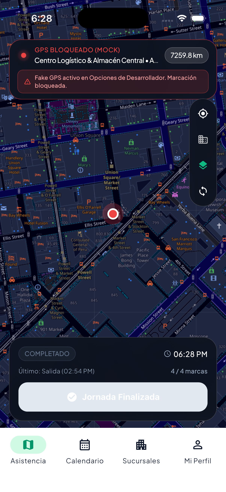
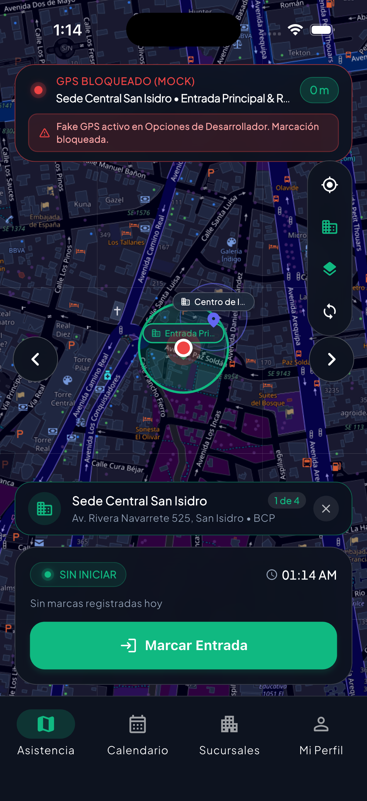
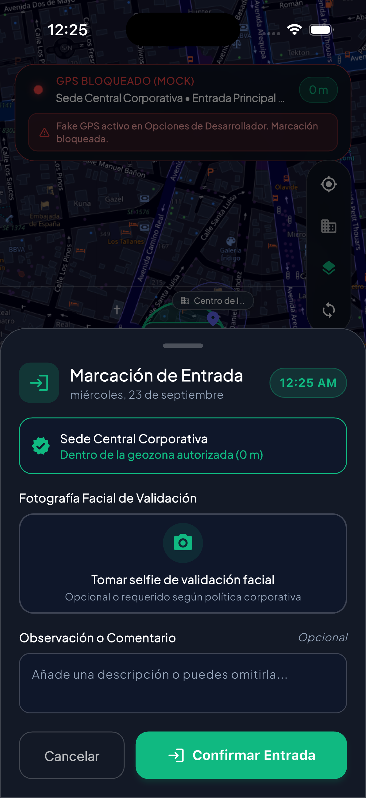
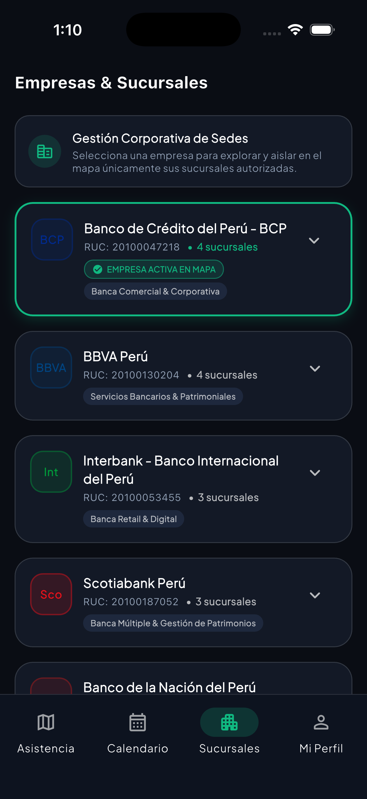
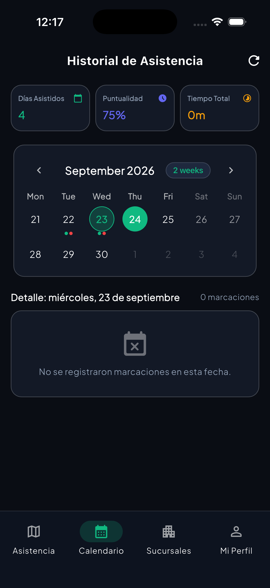
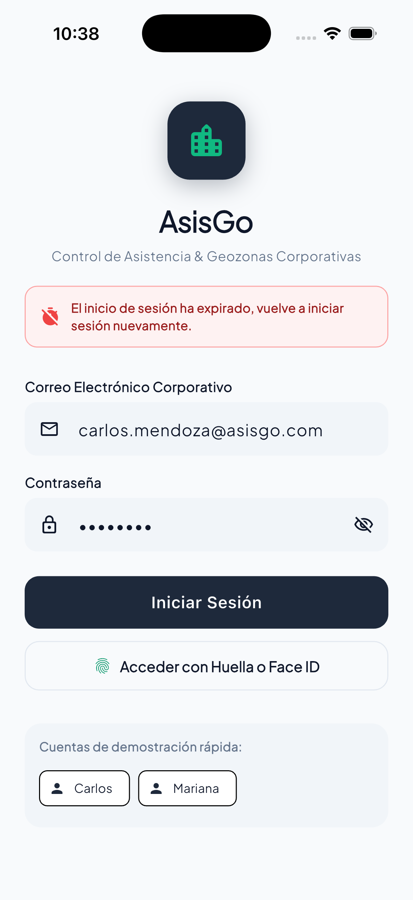
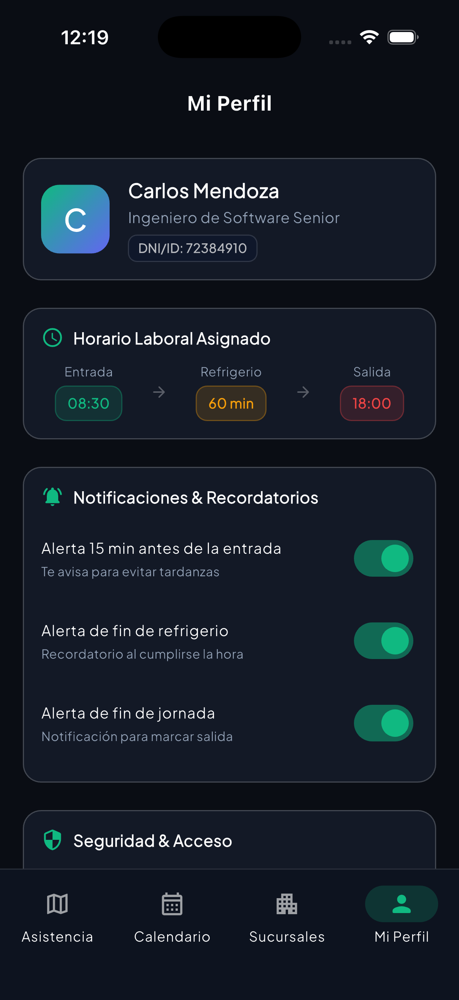

# AsisGo - Sistema Móvil Corporativo de Control de Asistencia y Geolocalización

AsisGo es una solución móvil de nivel empresarial desarrollada en Flutter para la gestión, control y auditoría de asistencia de personal en tiempo real, respaldada por validación geodésica de alta precisión y mecanismos de seguridad de hardware contra suplantación de ubicación.

---

## Capturas de Pantalla de la Aplicación

| Inicio de Sesión Corporativo | Mapa Interactivo Midnight | Marcación Rápida & Selfie |
| :---: | :---: | :---: |
|  |  |  |

| Jerarquía Multi-Empresa | Calendario & Auditoría | Expiración de Sesión (10 min) |
| :---: | :---: | :---: |
|  |  |  |

| Perfil & Horario Asignado |
| :---: |
|  |

---

## Características Principales

### 1. Seguridad Avanzada y Detección Anti-Fake GPS
- Verificación de telemetría de hardware en tiempo de ejecución para identificar proveedores simulados (Mock Providers), aplicaciones de falseo de ubicación y anomalías en la precisión de señal satelital.
- Bloqueo preventivo de marcaciones cuando se detectan discrepancias o herramientas de suplantación activas en el dispositivo.
- Control de modo estricto en producción con bandera configurable a nivel de servicio para pruebas unitarias y entornos de desarrollo controlados.

### 2. Jerarquía Corporativa Multi-Empresa de Tres Niveles
El sistema implementa una estructura de datos normalizada para organizaciones corporativas:
- **Nivel 1: Empresa (Corporativo):** Datos fiscales, identidad visual, RUC y directivas de asistencia.
- **Nivel 2: Sucursales (Sedes):** Establecimientos físicos distribuidos geográficamente en Lima (BCP, BBVA, Interbank, Scotiabank, Entelgy) con códigos de identificación únicos.
- **Nivel 3: Geocercas Autorizadas (Centros):** Coordenadas geodésicas centrales (latitud, longitud), radios de tolerancia métrica (100 m - 150 m) y nombres asignados por área operativa (Oficinas Administrativas, Torre Principal, Plataforma Financiera).

### 3. Aislamiento Visual en Mapa Interactivo
- Renderizado de mapa en modo Midnight Dark optimizado para visualización en exteriores y reducción de fatiga visual.
- Aislamiento estricto de entidades: al seleccionar una empresa o sede específica, el mapa renderiza exclusivamente las geocercas y marcadores de dicha entidad, evitando la saturación de elementos ajenos.
- Controles de recentrado automático, sincronización satelital y exploración directa de sedes asociadas.

### 4. Ciclo de Turno Laboral y Modal de Marcación Rápida
- Máquina de estados para el ciclo de jornada:
  1. Entrada inicial (`checkIn`)
  2. Inicio de refrigerio (`lunchStart`)
  3. Fin de refrigerio (`lunchEnd`)
  4. Salida de jornada (`checkOut` o salida anticipada)
- Modal simplificado de asistencia diseñado para registro rápido: cálculo geodésico Haversine de proximidad, verificación facial mediante selfie frontal y campo opcional para notas operativas.

### 5. Temporizador de Seguridad y Expiración de Sesión
- Cierre preventivo de sesión tras 10 minutos de permanencia en el sistema para resguardar la identidad del colaborador.
- Interfaz no intrusiva: despliegue de diálogo modal con fondo difuminado sobre la vista de mapa activa, informando de la expiración sin cierres abruptos.
- Redirección controlada a la pantalla de autenticación para nuevo ingreso manual de credenciales o biometría.

### 6. Historial de Asistencia y Calendario de Auditoría
- Resumen mensual de métricas clave (horas efectivas laboradas, días asistidos y porcentaje global de puntualidad con tolerancia de entrada).
- Vista de calendario interactivo para consultar el detalle cronológico de marcaciones por fecha seleccionada.

---

## Arquitectura de Software

El proyecto sigue una arquitectura desacoplada basada en Clean Architecture y el patrón de gestión de estado BLoC / Cubit:

```
lib/
├── app/
│   └── main_navigation_shell.dart         # Contenedor de navegación principal y escucha de expiración
├── core/
│   ├── constants/
│   │   ├── app_colors.dart                # Paleta de color corporativa y diseño medianoche
│   │   └── app_constants.dart             # Llaves de almacenamiento y parámetros del sistema
│   ├── contracts/
│   │   ├── i_location_service.dart        # Contrato de servicios de localización
│   │   └── i_security_service.dart        # Contrato de servicios de seguridad anti-mock
│   ├── security/
│   │   ├── security_service.dart          # Lógica de detección de proveedores simulados
│   │   ├── security_check_result.dart     # Modelo de dictamen de integridad
│   │   └── session_timer_manager.dart     # Gestor del temporizador de 10 minutos de inactividad
│   ├── services/
│   │   ├── location_service.dart          # Transmisión GPS y fórmulas geodésicas Haversine
│   │   ├── notification_service.dart      # Notificaciones locales de jornada laboral
│   │   └── storage_service.dart           # Persistencia local mediante SharedPreferences
│   ├── theme/
│   │   └── app_theme.dart                 # Configuración de temas claro y medianoche oscuro
│   ├── utils/
│   │   └── date_formatter.dart            # Utilidades de formato de fechas y horas en español
│   └── widgets/
│       ├── asis_glass_card.dart           # Componente de tarjeta con efecto frosted glass
│       ├── asis_security_dialog.dart      # Diálogo modal de alerta de suplantación GPS
│       └── asis_session_expired_dialog.dart # Diálogo modal de expiración de sesión
└── features/
    ├── attendance_map/
    │   ├── data/
    │   │   ├── attendance_repository.dart # Repositorio y siembra de marcaciones históricas
    │   │   └── branch_repository.dart     # Repositorio multi-empresa y sedes de Lima
    │   ├── domain/
    │   │   ├── attendance_record.dart     # Entidad de registro de asistencia
    │   │   ├── branch.dart                # Entidad de sede y geocercas
    │   │   ├── company.dart               # Entidad corporativa
    │   │   └── shift_phase.dart           # Enum de fases de turno y transiciones
    │   └── presentation/
    │       ├── cubit/                     # Cubits de asistencia y localización
    │       ├── views/                     # Pantalla de mapa y explorador de sucursales
    │       └── widgets/                   # Docks, botones flotantes y modal de marcación
    ├── auth/
    │   ├── data/auth_repository.dart      # Repositorio de credenciales y usuarios demo
    │   ├── domain/user.dart               # Modelo de usuario corporativo
    │   └── presentation/                  # Vistas y cubit de autenticación
    ├── calendar_history/
    │   └── presentation/                  # Cubit y vista de calendario de marcaciones
    └── profile/
        └── views/profile_view.dart        # Vista de perfil, configuración y horario asignado
```

---

## Requisitos del Entorno

- **Flutter SDK:** >= 3.19.0 (Canal Stable)
- **Dart SDK:** >= 3.3.0
- **Android:** API Nivel 24 (Android 7.0) o superior
- **iOS:** iOS 14.0 o superior
- **macOS:** Requerido para compilación iOS / Xcode

---

## Instalación y Ejecución

1. Clonar el repositorio:
```bash
git clone https://github.com/VMichael1999/AsisGo.git
cd AsisGo
```

2. Descargar las dependencias del proyecto:
```bash
flutter pub get
```

3. Ejecutar el análisis estático de código:
```bash
flutter analyze
```

4. Ejecutar la suite completa de pruebas unitarias:
```bash
flutter test
```

5. Iniciar la aplicación en el dispositivo o simulador activo:
```bash
flutter run
```

---

## Cuentas de Acceso de Demostración

Para fines de prueba y validación rápida, la aplicación incluye credenciales precargadas:

| Correo Electrónico | Contraseña | Cargo Asignado | Empresa |
| :--- | :--- | :--- | :--- |
| `carlos.mendoza@empresa.com` | `123456` | Senior Systems Engineer | Banco de Crédito BCP |
| `ana.torres@empresa.com` | `123456` | Lead Security Architect | BBVA Perú |

---

## Licencia

Este proyecto está bajo licencia de uso corporativo confidencial. Todos los derechos reservados.
